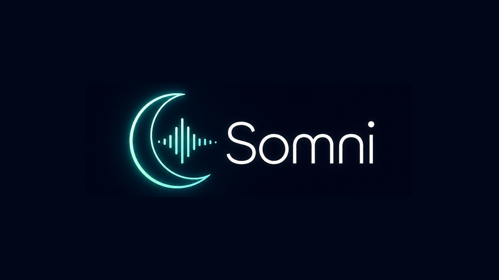
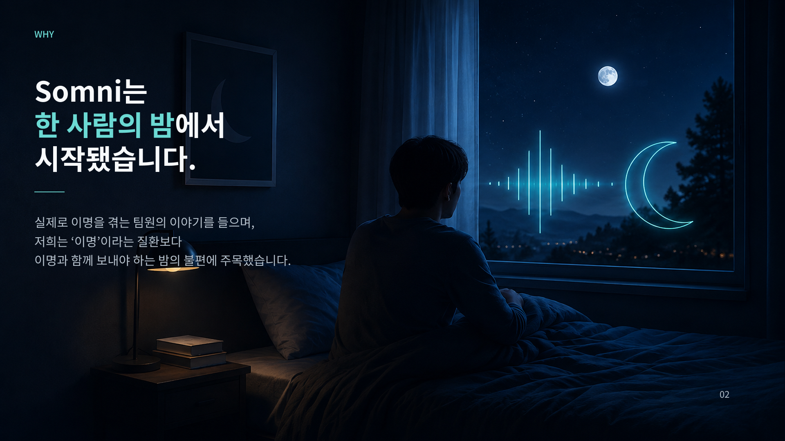
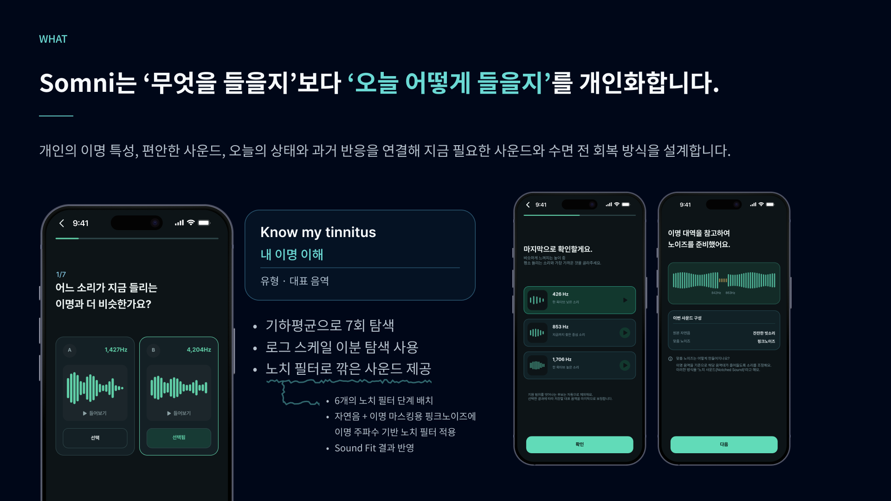
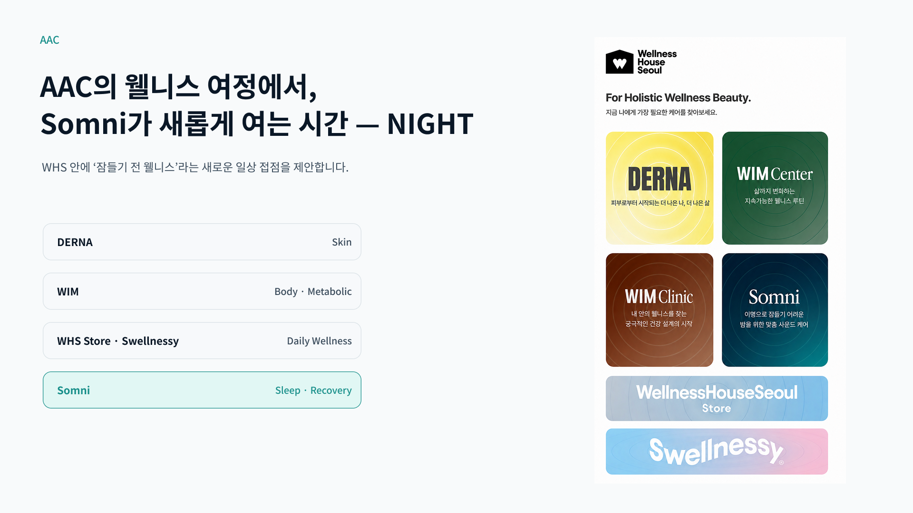
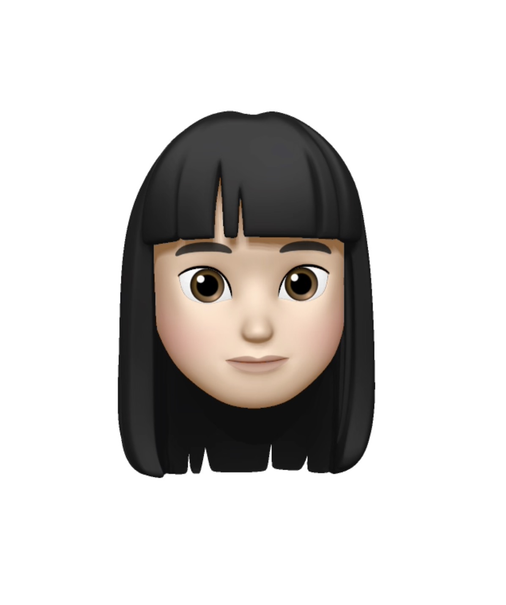

# 🌙 Somni

> **이명으로 잠들기 어려운 밤을 위한 AI 기반 개인 맞춤형 수면 웰니스 서비스**

 

Somni는 사용자의 **이명 특성, 사운드 취향, 오늘의 상태, 이전 세션 반응**을 연결해  
매일 밤 필요한 사운드와 수면 전 회복 방식을 개인화합니다.

 

  

  

---

### 🗓️ 프로젝트 기간

**2026년 7월 ~ 2026년 8월**

 

### 🌐 Somni 서비스

---

## 📑 목차

1. [💡 서비스 개발 배경](#1)
2. [🌙 서비스 소개](#2)
3. [✨ 핵심 기능](#3)
4. [🧠 개인화 로직](#4)
5. [📱 서비스 플로우](#5)
6. [🏠 AAC × Somni](#6)
7. [🛠️ Tech Stack](#7)
8. [👥 Contributors](#8)
9. [📁 Project Structure](#9)
10. [📱 PWA](#10)

 

## 💡 서비스 개발 배경

### 잠들기 직전, 이명은 더 크게 느껴질 수 있습니다.

주변 소리가 줄어드는 밤에는 이명이 상대적으로 더 크게 느껴지고,  
사용자는 잠들기 위해 백색소음, 자연음, 음악, 영상 등 다양한 방법을 시도합니다.

하지만 문제는 **들을 수 있는 사운드가 부족한 것**이 아닙니다.

> **“오늘은 어떤 소리를, 어느 정도로, 어떻게 들어야 하지?”**

사용자는 매일 자신의 상태에 맞는 방법을 다시 탐색하고 판단해야 합니다.

Somni는 이 문제를

> **이명으로 잠들기 어려운 사용자가 매일 자신의 상태에 맞는  
> 수면 전 개입 방식을 다시 결정해야 하는 문제**

로 정의했습니다.

 

  

---

## 🌙 서비스 소개

### **Know → Fit → Care → Learn**

Somni는 단순한 수면 사운드 추천 서비스가 아닙니다.

사용자의

**이명 특성 + 사운드 취향 + 오늘 상태 + 이전 세션 반응**

을 연결해 오늘 필요한 **사운드와 수면 전 회복 방식**을 결정합니다.

### Somni의 차별점

| 기존 방식 | Somni |
|:---|:---|
| 사용자가 매일 직접 사운드 탐색 | **오늘 필요한 방식을 먼저 제안** |
| 모두에게 동일한 완성 음원 | **이명 음역과 취향을 반영한 사운드 조합** |
| 현재 상태와 무관한 재생 | **Daily Check-in 기반 세션 구성** |
| 한 번의 추천으로 종료 | **다음 날 반응을 다시 개인화에 반영** |
| 무엇을 들을지 중심 | **오늘 어떻게 들을지까지 개인화** |

---

## ✨ 핵심 기능

### 🎧 01. 내 이명 이해

사용자가 자신의 이명과 비슷한 소리를 직접 비교하며  
**개인화 사운드를 위한 기준 음역**을 찾습니다.

- 이명 소리 유형 선택
- A/B 비교 기반 음역 탐색
- 로그 스케일 기반 적응형 매칭
- 마지막 옥타브 확인
- 대표 음역을 개인화 사운드에 활용

> 의료 진단을 위한 주파수 측정이 아닌 **개인화 사운드 설정을 위한 과정입니다.**

 

### 🎛️ 02. AI Sound Fit

같은 이명 음역을 가진 사용자라도 편안하게 느끼는 사운드는 다를 수 있습니다.

- 선호 자연음
- 사운드 질감
- 레이어 구성
- 개인화 노이즈 특성

을 바탕으로 사용자의 **기본 Sound Profile**을 구성합니다.

 

### 🌙 03. Daily Check-in

잠들기 전 짧은 체크인으로 오늘의 상태를 확인합니다.

- 이명 불편도
- 불안 정도
- 스트레스
- 피로
- 카페인 등 생활 요인

기본 Sound Profile과 오늘 상태를 함께 활용해  
오늘 필요한 회복 방식을 결정합니다.

 

### 🤖 04. AI Personalized Care

모든 사용자에게 같은 루틴을 제공하지 않습니다.

AI는 사용자의

**이명 특성 + 사운드 취향 + 오늘 상태 + 이전 반응**

을 연결해 다음 요소를 개인화합니다.

- 오늘의 사운드 사용 방식
- 필요한 CBT 기반 이완 활동
- 회복 세션 구성

 

### 🔊 05. Personalized Sound

Web Audio API를 활용해 자연음과 개인화 노이즈를 실시간으로 조합합니다.

- 자연음 기반 배경 사운드
- 이명 음역 기반 개인화 노이즈
- 조건에 따른 Notch Filter
- 실시간 사운드 믹싱
- 자연스러운 Fade-out
- 사용자 직접 Mixing Point 조절

 

### 🧘 06. CBT 기반 이완 활동

잠들기 직전 화면을 오래 보지 않도록  
**오디오 중심의 짧은 이완 활동**을 제공합니다.

- 생각 거리두기
- 주의 옮기기
- 복식호흡

 

### 🌅 07. Next-day Feedback

수면 직전에는 평가를 요구하지 않습니다.

다음 날 다시 Somni에 들어오면 다음 항목을 확인합니다.

- 세션이 편안했는지
- 잠드는 데 도움이 되었는지
- 불편했던 요소가 있었는지

평가 결과는 이후 개인화에 다시 반영됩니다.

 

### 📊 08. AI Analysis Report

축적된 체크인과 세션 반응을 기반으로 최근 개인화 결과를 AI가 분석합니다.

단순한 추천 결과뿐 아니라

> **어떤 상태와 반응을 근거로 현재의 개인화 방향이 결정되고 있는지**

사용자가 이해할 수 있도록 제공합니다.

 

  

---

## 🧠 개인화 로직

Somni는 한 번 정한 사용자 유형만으로 사운드를 추천하지 않습니다.

| 개인화 정보 | 활용 |
|:---|:---|
| **Tinnitus Profile** | 사용자의 이명 유형과 대표 음역 |
| **Sound Profile** | 편안하게 느끼는 기본 사운드 특성 |
| **Daily Context** | 오늘의 불편도 · 불안 · 스트레스 · 피로 |
| **Past Response** | 이전 세션 만족도와 불편 요소 |

이를 통해

> **“이 사람에게 무엇이 좋은가?”**

뿐 아니라

> **“이 사람에게 오늘은 어떻게 사용하는 것이 좋은가?”**

를 결정합니다.

### 🔊 Sound Personalization

**Natural Sound + Personalized Noise + Frequency-based Processing + User Mixing Point → Today's Personalized Sound**

일부 사운드에는 사용자의 대표 이명 음역을 기준으로  
해당 대역을 낮춘 **Notch Filter**를 적용합니다.

모든 사용자에게 동일하게 적용하지 않고  
이명 프로필과 사운드 구성에 따라 다르게 사용합니다.

---

## 📱 서비스 플로우

### ① 최초 설정

**이명 유형 선택 → 이명 음역 A/B 매칭 → 옥타브 확인 → 선호 자연음 선택 → AI Sound Fit → Sound Profile 생성**

 

### ② 매일 밤

**Daily Check-in → 오늘 상태 분석 → AI 개인화 회복 방식 결정 → CBT 기반 오디오 이완 → 개인화 사운드 재생 → Mixing Point 조절 → Fade-out**

 

### ③ 다음 날

**전날 세션 평가 → 개인화 가중치 업데이트 → 최근 상태 · 반응 분석 → 다음 회복 세션에 반영**

---

## 🏠 AAC × Somni

  

AAC의 기존 Wellness 접점에 Somni는

### **Sleep · Recovery · Night Wellness**

라는 새로운 시간을 제안합니다.

**DERNA (Skin) → WIM (Body · Metabolic) → WHS Store · Swellnessy (Daily Wellness) → Somni (Sleep · Recovery)**

클리닉이나 제품을 이용하는 특정 순간뿐 아니라  
**매일 잠들기 직전의 시간까지 웰니스 경험을 확장**합니다.

Somni를 통해 만들어지는 수면 전 상태와 회복 반응 데이터는  
향후 WellnessHouseSeoul 안에서 사용자의 일상 웰니스 여정을  
더 입체적으로 이해할 수 있는 새로운 접점이 될 수 있습니다.

---

## 🛠️ Tech Stack

### 📌 기획 / 디자인

 

### 📌 백엔드

   

### 📌 프론트엔드

     

### 📌 서버 / DevOps

    

---

## 👥 Contributors

<table>
<tr>

<th align="center" width="20%">
 
<b>정여진</b> 
<a href="https://github.com/yejn1402">@yejn1402</a>
</th>

<th align="center" width="20%">
 
<b>김서연</b> 
<a href="https://github.com/kseooy">@kseooy</a>
</th>

<th align="center" width="20%">
 
<b>유수현</b> 
<a href="https://github.com/Yoo-Su-Hyeon">@Yoo-Su-Hyeon</a>
</th>

<th align="center" width="20%">
 
<b>김예빈</b> 
<a href="https://github.com/y2bnn">@y2bnn</a>
</th>

<th align="center" width="20%">
 
<b>양수빈</b> 
<a href="https://github.com/chubin925">@chubin925</a>
</th>

</tr>

<tr>
<td align="center"><b>PM</b></td>
<td align="center"><b>BE</b></td>
<td align="center"><b>BE</b></td>
<td align="center"><b>FE</b></td>
<td align="center"><b>FE</b></td>
</tr>

<tr>

<td align="center">
구상 및 기획 
UI/UX 디자인
</td>

<td align="center">
온보딩 
이명 프로필 
음역 매칭 
AI Sound Fit 알고리즘 
데일리 체크인 
마이페이지 
데이터 관리/초기화
</td>

<td align="center">
사용자 식별 (UUID) 
사운드 생성/재생 
케어 루틴 
개인화 가중치 학습 
상태 변화 추이/통계 
AI 분석 리포트 (OpenAI)
</td>

<td align="center">
음역 매칭 및 AI Sound Fit 로직 연동 
Web Audio API 기반 개인화 사운드·회복 세션 구현 
사용자 데이터 관리 
마이페이지 
배포
</td>

<td align="center">
온보딩 
홈 
데일리 체크인 
CBT 기반 이완 활동 
세션 결과 평가
</td>

</tr>
</table>

---

## 📁 Project Structure

<pre>
2026-likilion-ds2/
├── backend/
│   ├── apps/
│   │   ├── accounts/          # 사용자 식별 및 계정 관리
│   │   ├── onboarding/        # 온보딩 및 초기 안전 문항
│   │   ├── tinnitus/          # 이명 프로필 및 음역 매칭
│   │   ├── sound/             # 개인화 사운드 생성 및 재생
│   │   ├── soundfit/          # AI Sound Fit 알고리즘
│   │   ├── checkin/           # 데일리 체크인
│   │   ├── relaxtion/         # CBT 기반 이완 활동 및 케어 루틴
│   │   ├── feedback/          # 세션 결과 평가 및 피드백
│   │   ├── personalization/   # 개인화 개입 결정 및 AI 분석
│   │   ├── data/              # 사용자 데이터 관리 및 초기화
│   │   ├── mypage/            # 마이페이지 및 설정
│   │   └── home/              # 홈 데이터
│   ├── config/                # Django 프로젝트 설정
│   ├── manage.py
│   └── requirements.txt
│
└── frontend/
    ├── public/                # PWA 아이콘 및 정적 파일
    ├── src/
    │   ├── api/               # 백엔드 API 요청
    │   ├── app/               # 앱 및 라우터 설정
    │   ├── assets/            # 이미지 · 아이콘 · 오디오
    │   ├── audio/             # Web Audio API 오디오 처리
    │   ├── components/        # 공통 및 기능별 UI 컴포넌트
    │   ├── layouts/           # 공통 페이지 레이아웃
    │   ├── mock/              # 프론트엔드 정적 데이터
    │   ├── pages/             # 기능별 페이지
    │   ├── services/          # 서비스 로직
    │   ├── styles/            # 전역 스타일
    │   ├── utils/             # 공통 유틸리티
    │   └── main.tsx
    ├── index.html
    ├── package.json
    └── vite.config.ts         # Vite 및 PWA 설정
</pre>

---

## 📱 PWA

Somni는 **PWA(Progressive Web App)** 를 지원하여 모바일 환경에서 홈 화면에 설치해 앱처럼 사용할 수 있습니다.

- 모바일 홈 화면 설치 지원
- Standalone 모드 지원
- Service Worker 자동 업데이트 적용
- Somni 전용 앱 아이콘 및 테마 적용
- `vite-plugin-pwa` 기반 PWA 구성

---

## ⚠️ Wellness Scope

Somni는 의료기관의 진단이나 치료를 대체하지 않는  
**일상 관리 목적의 웰니스 서비스**입니다.

이명 음역 매칭 결과와 AI 분석은 의학적 진단값이 아니라  
개인화 사운드 및 회복 경험을 구성하기 위한 사용자 설정·참고 정보로 활용됩니다.

 

### 🌙 Somni

**하루의 마지막 순간까지,  
사용자가 자신의 상태를 혼자 판단하지 않아도 되도록.**

